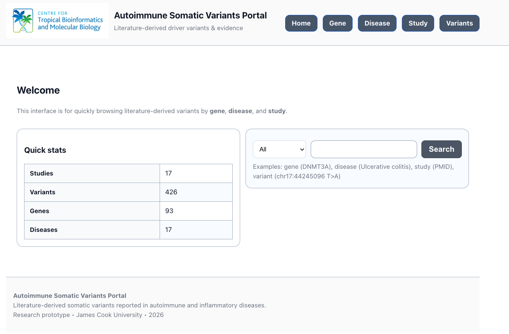
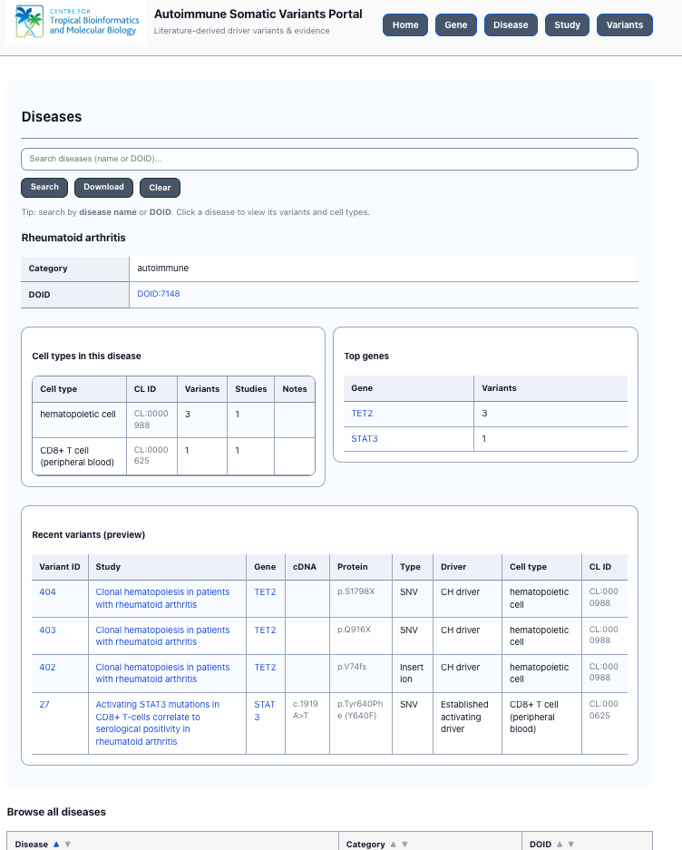
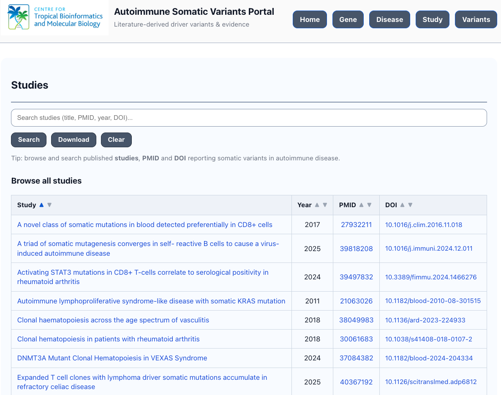
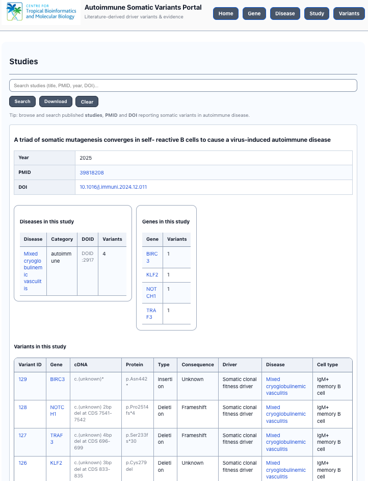
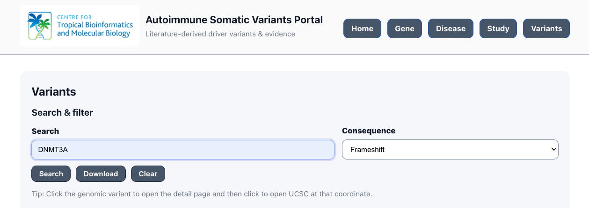

05_user_manual.md
Autoimmune Somatic Variants Portal — User Manual

1. Introduction

The Autoimmune Somatic Variants Portal is a curated research database and web interface designed to provide structured access to literature-derived somatic variants implicated in autoimmune and inflammatory diseases.

The system integrates:
•	peer-reviewed somatic variant data
•	standardized genomic coordinates
•	reference genome (GRCh37 / GRCh38)
•	disease Ontology (DOID) 
•	cell Ontology (CL) 
•	driver mutation classification
•	cross-study aggregation and recurrence metrics

This manual provides a comprehensive guide for navigating and using the portal. 

2. Homepage Overview

*Figure 1. Home page of the Autoimmune Somatic Variants Portal.*

Homepage functions as the central entry point to the Autoimmune Somatic Variants Portal. It provides:
 
•	portal title and scope statement
•	high-level dataset summary
•	unified search interface
•	primary navigation controls

The interface is designed for access to curated literature-derived somatic variants associated with autoimmune and inflammatory diseases. Users are encouraged to begin navigation through any entity depending on their research focus.

2.1 Navigation Bar

Navigation bar located at the top right provides access to the major database entities:

•	Home — returns to the landing page.
•	Gene — browse and search gene-centric summaries.
•	Disease — explore disease-level variant aggregation.
•	Study — access publication-level metadata.
•	Variants — perform variant-level searches.

2.3 Quick Statistics Panel

Quick Stats panel provides real-time summary metrics derived from the underlying database:

Entity	Description
Studies	Number of curated peer-reviewed publications
Variants	Total number of distinct somatic variants
Genes	Unique genes with reported somatic variants
Diseases	Distinct autoimmune or inflammatory conditions

The statistics provide an immediate overview of:
•	dataset scale
•	curation coverage
•	breadth of disease representation
•	degree of variant recurrence across studies

2.4 Unified Search Interface

Search interface supports flexible query types via a dropdown selector and input field. Supported query types include:

•	Gene symbol (e.g., DNMT3A)
•	Disease name (e.g., Ulcerative colitis)
•	Study identifier (e.g., PMID)
•	Genomic coordinate (e.g., chr17:44245096 T>A)

Functionality
•	dropdown allows selection of query scope (e.g., search all entities or restrict to a specific entity type).
•	input field accepts structured coordinate strings.
•	search button executes the query and routes to the relevant result page.

3. Gene Page Overview

*Figure 2. Gene browse page.*

The Gene Browse View provides a searchable and sortable list of genes curated within the database. Each row summarizes:
•	Gene symbol
•	Number of unique variants
•	Number of associated studies
•	Number of associated diseases

Selecting a gene symbol opens the Gene Detail View, which provides variant-level evidence linked to that gene.

3.1 Gene Search Functionality

Search panel allows users to query the database using a HGNC gene symbol (e.g., DNMT3A, TET2, STAT3).

Input Field
•	accepts gene symbols
•	case-insensitive matching

Buttons
•	Search — Executes the query and filters results.
•	Download — Exports the current gene-level summary as a structured file (e.g., CSV).
•	Clear — Resets the search field and returns to full browse mode.

Feature supports:
•	retrieval of genes of interest
•	validation of whether a gene is represented in the curated dataset
•	quantitative assessment of gene recurrence across studies

3.2 Browse All Genes Table
The main table presents an aggregated summary for each gene in the database.

Column	Description
Gene	HGNC gene symbol (clickable)
Variants	Number of distinct genomic variants reported for the gene
Studies	Number of unique studies reporting variants in this gene
Diseases	Number of distinct diseases in which variants were reported

3.3 Sorting Functionality

Each of the column header contains ascending (▲) and descending (▼) sort, controls, which the users can sort by:
•	alphabetical gene name
•	variant burden
•	study recurrence
•	disease 

3.5 Navigating to Gene Detail Page

Clicking a gene symbol (e.g., ARID1A) redirects the user to the detailed Gene View page. The Gene Detail page provides:
•	variant-level breakdown
•	study-level evidence
•	disease annotations
•	driver classification
•	reference genome reporting

3.6 Gene Detail View (Example: ARID1A)

*Figure 3. Gene detail page.*

The Gene Detail View displays all curated somatic variants associated with the selected gene. The page includes:
•	Variant identifiers
•	cDNA and protein annotations
•	Variant type and consequence classification
•	Driver status
•	Associated disease
•	Cell type context

This structure allows users to evaluate gene-level mutational burden across autoimmune conditions and cellular compartments. In the example, the gene ARID1A is queried, and all literature-derived variants associated with ARID1A are displayed. 

3.6.1 Page Structure

The page contains three main components:

a. Gene Search Bar

Allows users to:
•	enter a new gene symbol
•	refine results
•	export gene-specific data
•	reset the query

b. Results Summary

Example:
Results for gene: ARID1A  
Showing 37 rows (limit 2000)

c. Variant Evidence Table
This table represents the core evidence layer of the database. Each row corresponds to a literature-derived somatic variant instance.

3.6.2 Column-Level Explanation

Column	Description
cDNA (HGVS)	HGVS cDNA-level description as reported or normalized
Protein	HGVS protein change (if available)
Variant	Genomic coordinate (paper or lifted) in chr:pos REF>ALT format
Variant type	SNV, deletion, insertion, frameshift, etc.
Consequence	Functional effect (e.g., missense, nonsense, frameshift)
Disease	Associated disease (clickable)
Category	Disease classification grouping
DOID	Disease Ontology identifier
Cell type	Tissue or cell population where mutation was detected
CL ID	Cell Ontology identifier
Study	Literature source (clickable)

3.6.3 Evidence Traceability

Each row is linked to:
•	specific publication (via Study link)
•	disease ontology mapping (DOID)
•	cell ontology mapping (CL ID)
•	normalized genomic coordinate

This provides full transparency between:

Variant → Study → Disease → Ontology → Cell Context

3.6.4 Download Functionality

The "Download" button allows export of:
•	full gene-level variant dataset
•	structured format (e.g., CSV)

4 Disease Browse Overview

*Figure 4. Disease browse page.*

The Disease Browse View lists all autoimmune and inflammatory diseases included in the database. Each disease entry includes:
•	Disease name
•	Category
•	Disease Ontology (DOID) identifier

Clicking a disease opens the Disease Detail View, which presents variant and cell type associations specific to that condition.

4.1 Page Structure

Disease Browse page contains:

a. Search Interface
Search bar allows filtering by:
•	disease name
•	disease ontology identifier (DOID)
•	category

b. Summary Table

Main table displays aggregated disease-level statistics. Each row corresponds to one disease entity in the database.

4.2 Column-Level Explanation

Column	Description
Disease	Curated disease name (clickable)
Category	Disease grouping (e.g., autoimmune, autoinflammatory, other)
DOID	Disease Ontology identifier
Variants	Number of unique somatic variants reported
Genes	Number of genes affected
Studies	Number of distinct publications reporting variants
Cell types	Number of distinct cell/tissue contexts

Disease Browse View supports questions such as:
•	Which diseases have the highest number of reported somatic variants?
•	Which autoimmune conditions show multi-gene involvement?
•	Are certain diseases enriched for specific driver mutations?
•	How many independent studies support somatic variant involvement in each given disease?

4.3 Navigation Flow

Loads the Disease Detail View, where:
•	all variants associated with that disease are displayed
•	gene-level associations are shown
•	study-level provenance is available

4.4 Disease Detail View

*Figure 5. Disease detail page.*

The Disease Detail View organizes information into three sections:
•	Disease metadata (category and DOID)
•	Cell type distribution of variants
•	Top recurrent genes and recent variants

This hierarchical layout enables researchers to evaluate disease-specific mutational patterns and their cellular contexts.

4.5 Disease Metadata Section

At the top of the page, core disease attributes are displayed:

Field	Description
Disease name	Curated disease label
Category	Classification (e.g., autoimmune, autoinflammatory)
DOID	Disease Ontology identifier

Example:
•	Disease: Rheumatoid arthritis
•	DOID: DOID:7148
•	Category: autoimmune

The DOID enables standardized mapping to external ontologies.

4.6 Cell-Type Stratification

The "Cell types in this disease" panel summarizes the cellular contexts in which somatic variants were reported.

Column	Description
Cell type	Reported tissue or immune cell
CL ID	Cell Ontology identifier
Variants	Number of distinct variants observed
Studies	Number of supporting publications
Notes	Optional remarks

This enables investigation of clonal or lineage-specific mutation patterns.

4.7 Top Genes Panel

The "Top genes" panel summarizes genes most frequently mutated in the selected disease.

Column	Description
Gene	Gene symbol (clickable)
Variants	Number of unique variants

This allows rapid identification of recurrent or candidate driver genes within a disease context.

4.8 Recent Variants (Preview)
"Recent variants" section displays curated mutation-level evidence.
Columns include:

Column	Description
Variant ID	Internal identifier
Study	Source publication (clickable)
Gene	Affected gene
cDNA	HGVS cDNA notation
Protein	HGVS protein change
Type	Variant class (SNV, insertion, deletion)
Driver	Curated driver classification
Cell type	Reported cell/tissue context
CL ID	Cell Ontology identifier

This section provides:
•	molecular-level mutation details
•	evidence traceability
•	functional interpretation
•	study-level provenance

4.9 Driver Classification

“Driver” column represents curated interpretation of variant significance.
Possible labels include:
•	CH driver
•	established activating driver
•	candidate driver
•	disease driver

This annotation reflects manual literature curation and classification.

5 Study Browse View

*Figure 6. Study browse page.*

Study Browse View provides a structured index of all peer-reviewed publications curated within the Autoimmune Somatic Variants Portal. The interface enables users to:
•	search studies by title, PMID, DOI, or year
•	sort publications chronologically
•	access primary literature directly
•	navigate to study-level mutation summaries

The Study module ensures full traceability from database entries to the original scientific source.

5.1 Search Functionality

Search field supports flexible queries including:
•	study title keywords
•	PubMed ID (PMID)
•	DOI
•	publication year

5.2 Study Table Columns
The table displays the following attributes:
Column	Description
Study	Full publication title (clickable link to study detail page)
Year	Publication year
PMID	PubMed identifier (clickable)
DOI	Digital Object Identifier (clickable external link)

5.3 Sorting Capabilities
Column headers include sorting toggles (▲▼), allowing:
•	ascending/descending sorting by title
•	chronological sorting by year
•	numeric sorting by PMID

5.4 External Linking
PMID and DOI values link to external resources:
•	PMID → PubMed
•	DOI → Publisher website

5.5 Study Detail View

*Figure 7. Study detail page.*

Study Detail View presents a structured, study-centric summary of all curated somatic variants reported in a specific publication. The page integrates:
•	bibliographic metadata
•	disease associations
•	gene-level summaries
•	variant-level evidence
•	driver classification
•	cell-type context

5.6.1 Bibliographic Metadata

The upper section displays core study attributes:

Field	Description
Title	Full publication title
Year	Publication year
PMID	PubMed identifier (clickable external link)
DOI	Digital Object Identifier (clickable external link)

These fields allow direct verification against the original peer-reviewed source.

5.6.2 Disease Summary Panel

“Diseases in this study” panel lists all diseases investigated in the publication.
Columns include:

Column	Meaning
Disease	Disease name (clickable link to disease page)
Category	Broad classification (e.g., autoimmune, inflammatory)
DOID	Disease Ontology ID
Variants	Number of curated variants reported in this disease within the study

5.6.3 Gene Summary Panel

“Genes in this study” panel lists all genes reported as mutated.

Column	Meaning
Gene	HGNC gene symbol (clickable)
Variants	Number of distinct variants reported for the gene in this study

This panel provides a gene-level distribution of mutations.

5.6.4 Variant in this study

The lower section presents detailed variant-level records. Each row represents one curated variant entry.

Column	Description
Variant ID	Internal database identifier
Gene	Gene symbol
cDNA	HGVS cDNA annotation (when available)
Protein	Protein-level HGVS annotation
Type	Variant type (SNV, insertion, deletion, etc.)
Consequence	Functional consequence (e.g., frameshift)
Driver	Curated driver classification
Disease	Disease context
Cell type	Reported cellular compartment

5.6.5 Cross-Entity Navigation

Each clickable entity enables relational traversal:
•	Gene → Gene page (aggregated view)
•	Disease → Disease page (cross-study view)
•	Variant ID → Variant detail page
•	PMID/DOI → External literature

This structure enables multi-layer navigation across:

Study → Variant → Gene → Disease → Cell type

6 Variant Browse and Filter View

*Figure 8. Variant browse page.*

The Variant Browse View provides a comprehensive, filterable list of all curated somatic variants. Columns include:
•	Variant ID
•	Study
•	Gene
•	cDNA and protein change
•	Variant type
•	Consequence classification
•	Driver status
•	Disease and cell type

Users may filter results by consequence, gene, disease, or coordinate before exporting data.

6.1	Search and Filtering

a.	Global Search Field

Search bar supports flexible queries, including:
•	Gene symbol (e.g., DNMT3A)
•	Disease name
•	Study title or PMID
•	HGVS cDNA or protein notation
•	Genomic coordinate (e.g., chr12:8857315 C>T)

b.	Consequence Filter

Dropdown menu allows filtering by functional consequence, including:
•	frameshift
•	nonsense
•	missense
•	unknown
•	other curated classifications

6.1 Variant Table Structure

Each row represents a unique genomic coordinate.

Column	Description
Gene	HGNC gene symbol (clickable)
Reference genome	GRCh37 or GRCh38
Genomic variant	Chromosome, position, reference and alternate allele
Consequence	Functional annotation
Reports	Number of literature-reported instances
Studies	Number of distinct studies reporting this coordinate

6.2 Coordinate Standardization

Genomic variants are displayed in the format:

chrX:position REF>ALT

For example:
chr12:8857315 C>T

The reference genome column explicitly indicates whether coordinates correspond to:
•	GRCh37 (hg19)
•	GRCh38 (hg38)

Coordinates displayed in the interface always correspond to the declared reference genome build to ensure consistency with external genomic resources (e.g., UCSC Genome Browser).

6.3 Navigation Workflow

Clicking the Genomic variant link opens the Variant Detail Page, which provides:
•	Full evidence records
•	Gene association
•	Disease context
•	Cell-type mapping
•	Driver classification
•	UCSC Genome Browser integration
Clicking the Gene symbol opens the Gene page for cross-study aggregation.

6.4 Report and Study Counts

The Reports column reflects:

Total curated literature entries for the specific genomic coordinate.

The Studies column reflects:

Number of distinct publications reporting the variant.

These metrics allow rapid identification of:
•	Recurrent variants
•	Cross-study drivers
•	Potential hotspot mutations

6.5 Integration with External Resources

Clicking a variant:
•	Opens the Variant Detail Page.
•	From there, users can open the UCSC Genome Browser at the exact coordinate.
•	Coordinates align with declared reference genome builds.

6.6 Data Export

Download button exports the currently filtered dataset in tabular format, suitable for:
•	Statistical analysis
•	Downstream bioinformatics workflows
•	Supplementary publication materials

6.8 Variant Detail View (Coordinate Mode)

*Figure 9. Variant detail page.*

The Variant Detail View (ID Mode) displays all curated evidence for a specific variant entry. The page includes:
•	Genomic coordinate and reference genome build
•	cDNA and protein annotations
•	Consequence classification
•	Driver interpretation
•	Associated diseases and studies
•	Evidence types and remarks

This view is designed to support in-depth evaluation of individual somatic variants.

6.8.1 Variant Summary Section

The upper panel displays a summarized view of the genomic coordinate.

Displayed Fields

Field	Description
Gene	HGNC gene symbol (clickable link to Gene page)
Reference genome	GRCh37 or GRCh38
Genomic variant	Standardized coordinate (chr:pos REF>ALT)
Consequence	Functional classification
# Reports	Total curated literature entries
# Studies	Number of distinct studies reporting the variant
Studies	Titles of publications reporting the mutation

6.8.2 Coordinate Integrity and Genome Build

Coordinate displayed reflects the curated reference genome build. The system ensures:
•	Consistency between displayed coordinate and genome build
•	Explicit declaration of GRCh37 or GRCh38
•	Accurate alignment with external genomic tools

6.8.3 Evidence Rows

The lower panel lists individual curated evidence entries. Each row corresponds to a distinct literature-derived record.

Evidence Table Columns
Column	Description
cDNA (HGVS)	Transcript-level mutation
Protein	Amino acid change (if reported)
Variant type	SNV, insertion, deletion, etc.
Consequence	Functional classification
Disease	Disease context (clickable)
Cell type	Affected cellular compartment
Study	Publication reporting the mutation

6.8.4 Cross-Navigation

From this page, users may navigate to:
•	Gene page (via gene link)
•	Disease page (via disease link)
•	Study page (via study title)

6.8.5 UCSC Genome Browser Integration
Clicking the genomic coordinate, users may open the UCSC Genome Browser at the exact coordinate. 

7 Variant Data Download Functionality

*Figure 10. Variant data download functionality.*

Variant page provides structured data export functionality to enable downstream computational analysis. This download feature allows users to extract curated somatic variant records in a machine-readable format. Unlike static display tables, the download function provides direct access to structured data suitable for:
•	Statistical analysis
•	Mutation frequency calculations
•	Driver classification review
•	External bioinformatic pipelines
•	Reproducibility archiving

7.1 Download Scope Logic

Exported dataset dynamically reflects the active user context at the time of download. Specifically, the CSV file contains:
•	All rows matching the current search term (if any)
•	All rows matching the selected consequence filter (if applied)
•	All rows currently included in the SQL query result

The download represents the filtered dataset state, not merely the visible table rows.

7.2 Export File Format

The file is exported as:
•	Format: CSV (Comma-Separated Values)
•	Encoding: UTF-8
•	Includes header row
•	Compatible with Excel, R, Python, and statistical software

7.3 Columns Included in Variant Export

The export includes integrated fields derived from the curated database view:

Field	Description
gene_symbol	HGNC gene symbol
ref_genome	Reference genome build (GRCh37 / GRCh38)
genomic_variant	Chromosome position with ref/alt allele
variant_type	SNV, insertion, deletion, indel
consequence	Functional classification
study_id	Internal study identifier
disease_name	Associated disease
cell_type_name	Reported cell type
is_driver	Driver classification label
evidence_type	Evidence annotation

7.4 Download Behaviour Under Filtering

A. No Filter Applied
Exports the entire curated variant dataset.

B. Consequence Filter Applied
Exports only variants matching the selected functional consequence.

C. Search Term Applied
Exports only records matching the search query (gene, disease, study, or coordinate).

D. Combined Search + Filter
Exports intersection of both conditions.

7.5 Practical example

*Figure 11. Download example.*

Example workflow:
•	Navigate to variants page.
•	Select “Frameshift” in consequence filter.
•	Click “Download”.
•	The exported file will contain only frameshift variants.

